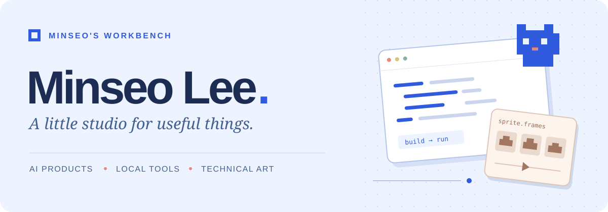
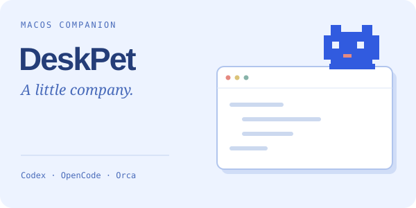
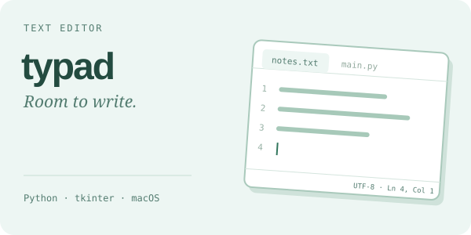
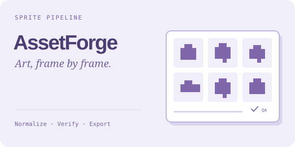

  

  I build AI products, local-first tools, and game-asset pipelines.

  <a href="https://minseo-log.vercel.app"><strong>Build notes ↗</strong></a>
  &nbsp;&nbsp;·&nbsp;&nbsp;
  <a href="https://yeonwol.vercel.app"><strong>연월 ↗</strong></a>
  &nbsp;&nbsp;·&nbsp;&nbsp;
  <a href="mailto:mindsurf0176@gmail.com"><strong>Say hello ↗</strong></a>

 

### On my workbench

<table>
  <tr>
    <td width="50%" valign="top">
      
      
A desktop companion for Codex, OpenCode, and Orca.

      
<a href="https://github.com/mindsurf0176/deskpet"><strong>DeskPet ↗</strong></a> &nbsp; <a href="https://github.com/mindsurf0176/deskpet/releases/tag/v1.3">v1.3 · notarized</a>

    </td>
    <td width="50%" valign="top">
      
      
A lightweight editor with tabs, syntax highlighting, and workspace search.

      
<a href="https://github.com/mindsurf0176/typad"><strong>typad ↗</strong></a> &nbsp; <a href="https://github.com/mindsurf0176/typad/releases/tag/v0.3.0">v0.3.0</a>

    </td>
  </tr>
  <tr>
    <td width="50%" valign="top">
      
      
타로와 사주로 지금의 고민을 돌아보는 시간.

      
<a href="https://yeonwol.vercel.app"><strong>Visit 연월 ↗</strong></a>

    </td>
    <td width="50%" valign="top">
      
      
Normalize, validate, and export sprite animations for web games and Godot.

      
<a href="https://github.com/mindsurf0176/assetforge"><strong>AssetForge ↗</strong></a>

    </td>
  </tr>
</table>

 

### Pixels in motion

**[Vesper ↗](https://github.com/mindsurf0176/vesper)** &nbsp; / &nbsp; State-based sprites, deterministic assembly, and Godot runtime QA.

 

### Also on the shelf

- **[RelayCode ↗](https://github.com/mindsurf0176/relaycode)** — Local Codex from your phone. Repositories and credentials stay on the Mac.
- **[CutAI ↗](https://github.com/mindsurf0176/cutai)** — Local video editing with natural-language commands.
- **[PixelForge ↗](https://github.com/mindsurf0176/pixelforge-mcp)** — Game-ready pixel sprites, with an [Unreal Engine bridge](https://github.com/mindsurf0176/pixelforge-ue5-bridge).
- **[Kotoba ↗](https://github.com/mindsurf0176/kotoba)** — Offline Japanese, ONNX neural TTS, and FSRS v5.
- **[Fissh ↗](https://github.com/mindsurf0176/fissh)** — Claude Code on your phone. QR pairing and Tailscale authentication.

 

  
   
  <strong>AI TOP 100 (CAMPUS) · 2026 Finalist</strong> One of 100 finalists selected from 3,000 students.

  Made with care, by Minseo.

