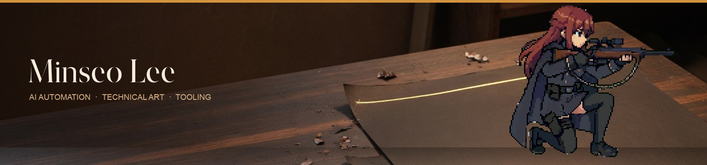
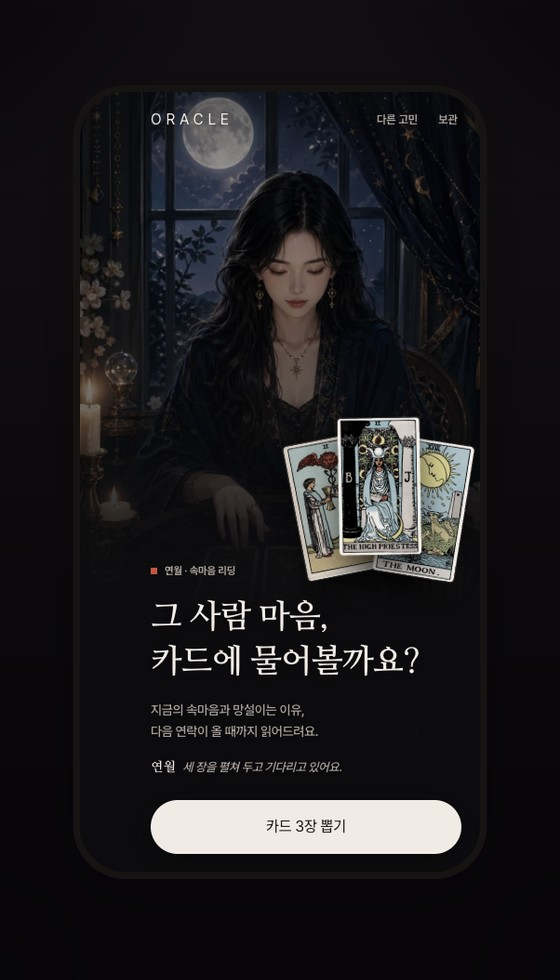
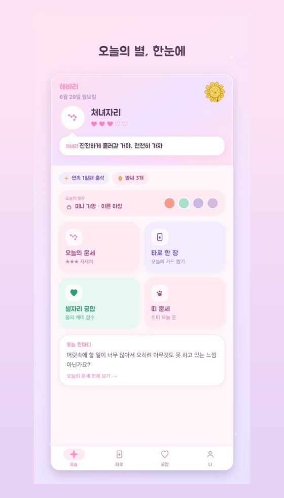
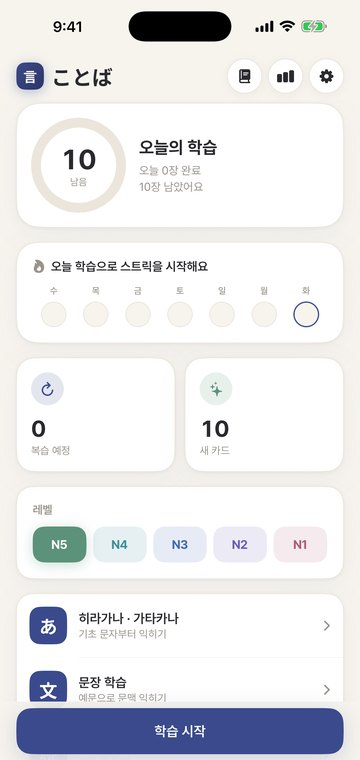
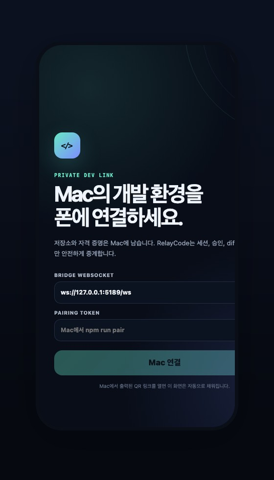
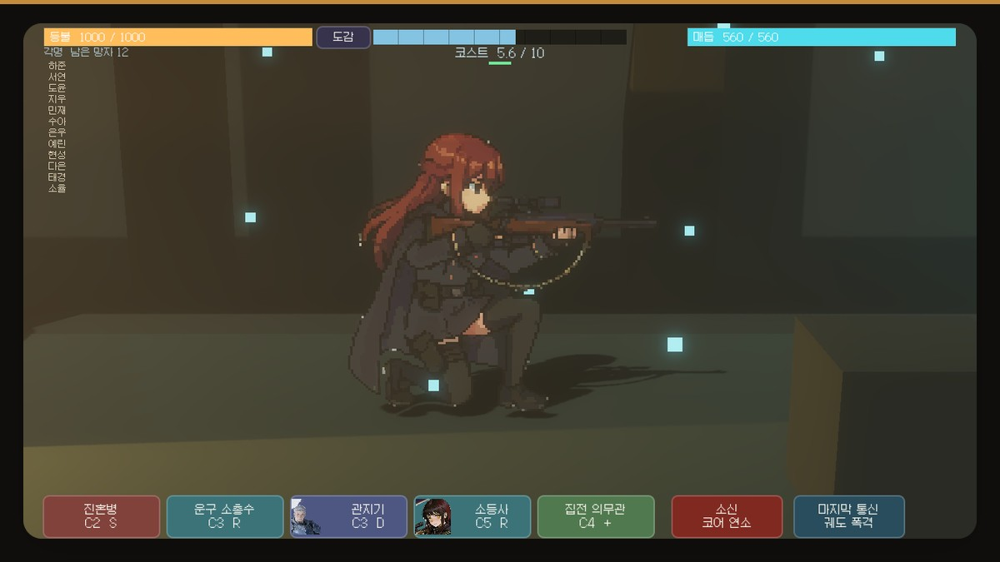
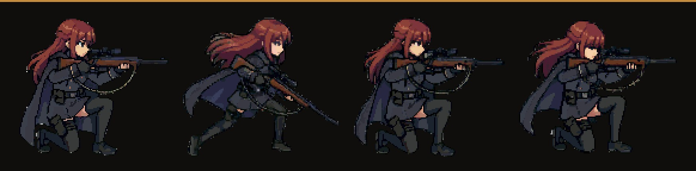

  

I don't paste model output into a repo. I turn it into a pipeline that can be measured, rerun, and verified at runtime — then I ship the consumer apps those pipelines feed.

  <a href="https://minseo-log.vercel.app">minseo.log</a>
  &nbsp;·&nbsp;
  <a href="https://oracletarot.kr">oracletarot.kr</a>
  &nbsp;·&nbsp;
  <a href="mailto:mindsurf0176@gmail.com">email</a>

---

<table>
  <tr>
    <td width="50%" valign="top" align="center">
      
       
      <strong><a href="https://oracletarot.kr">Oracle Tarot</a></strong> 
      Paid LLM service. Deterministic engine, multi-provider fallback, billing recovery.
    </td>
    <td width="50%" valign="top" align="center">
      
       
      <strong><a href="https://github.com/mindsurf0176/haebari">Haebari</a></strong> 
      Astrology app. Live on Toss, App Store under review.
    </td>
  </tr>
  <tr>
    <td width="50%" valign="top" align="center">
      
       
      <strong><a href="https://github.com/mindsurf0176/kotoba">Kotoba</a></strong> 
      Offline Japanese. ONNX neural TTS + FSRS v5.
    </td>
    <td width="50%" valign="top" align="center">
      
       
      <strong><a href="https://github.com/mindsurf0176/relaycode">RelayCode</a></strong> 
      Remote-control local Codex from a phone. Repos and credentials stay on the Mac.

    </td>
  </tr>
</table>

  

  <strong><a href="https://github.com/mindsurf0176/vesper">Vesper</a></strong>
  — state-based sprites, deterministic assembly, Godot runtime QA

  

### Pipelines & tools

| Project | What it is |
| --- | --- |
| **[PixelForge](https://github.com/mindsurf0176/pixelforge-mcp)** | AI illustration → in-game pixel sprites. [UE5 bridge](https://github.com/mindsurf0176/pixelforge-ue5-bridge) |
| **[AssetForge](https://github.com/mindsurf0176/assetforge)** | Deterministic 2D asset normalization, validation, and engine export. |
| **[CutAI](https://github.com/mindsurf0176/cutai)** | Local AI video editor driven by natural-language cuts. |
| **[Fissh](https://github.com/mindsurf0176/fissh)** | Claude Code from a phone. QR pairing, Tailscale auth. |

Build notes live on [minseo.log](https://minseo-log.vercel.app).

problem → measurable baseline → deterministic pipeline → runtime QA → production feedback

