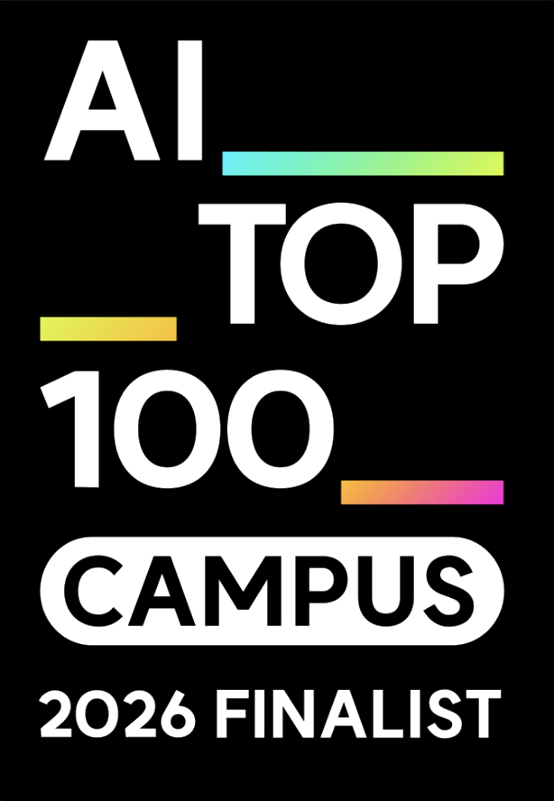

  

  

I build AI products, local-first developer tools, and game-asset pipelines. The interesting part is not a model call: it is the reliable system around it — clear constraints, reproducible output, and a product people can actually use.

  <a href="https://yeonwol.vercel.app">연월</a>
  &nbsp;·&nbsp;
  <a href="https://minseo-log.vercel.app">build notes</a>
  &nbsp;·&nbsp;
  <a href="mailto:mindsurf0176@gmail.com">email</a>

### Recognition

**[AI TOP 100 (CAMPUS)](https://aitop100.org/)** — Finalist · Apr 2026  
Kakao Impact × Brian Impact. Ministry of Science and ICT & Kakao.  
Selected as one of **100 finalists** from **3,000** students.

### Shipping now

| Project | What it does |
| --- | --- |
| **[DeskPet](https://github.com/mindsurf0176/deskpet)** · [v1.3](https://github.com/mindsurf0176/deskpet/releases/tag/v1.3) | A notarized macOS companion that reflects Codex, OpenCode, and Orca activity — with agent hooks, window perching, and configurable captions. |
| **[typad](https://github.com/mindsurf0176/typad)** · [v0.3.0](https://github.com/mindsurf0176/typad/releases/tag/v0.3.0) | A lightweight Notepad++-style editor for macOS: tabs, workspace search, syntax highlighting, and no third-party runtime dependencies. |
| **[연월](https://yeonwol.vercel.app)** | A Korean tarot and saju reading experience with a deliberate, visual entry flow. Live on the web. |
| **[AssetForge](https://github.com/mindsurf0176/assetforge)** | A deterministic 2D sprite pipeline: normalize, validate, preview, hash, and export animation assets for web games and Godot. |

### Selected builds

<table>
  <tr>
    <td width="50%" valign="top" align="center">
      
       
      <strong><a href="https://github.com/mindsurf0176/relaycode">RelayCode</a></strong> 
      Phone-to-Mac control for local Codex. Repositories and credentials remain on the Mac.
    </td>
    <td width="50%" valign="top" align="center">
      
       
      <strong><a href="https://github.com/mindsurf0176/vesper">Vesper</a></strong> 
      Godot technical art: state-based sprites, deterministic assembly, and runtime QA.
    </td>
  </tr>
</table>

  

### More tools

| Project | What it is |
| --- | --- |
| **[CutAI](https://github.com/mindsurf0176/cutai)** | A local AI video editor driven by natural-language edit commands. |
| **[PixelForge](https://github.com/mindsurf0176/pixelforge-mcp)** | AI illustration to game-ready pixel sprites, with an [Unreal Engine bridge](https://github.com/mindsurf0176/pixelforge-ue5-bridge). |
| **[Kotoba](https://github.com/mindsurf0176/kotoba)** | Offline Japanese learning with ONNX neural TTS and FSRS v5. |
| **[Fissh](https://github.com/mindsurf0176/fissh)** | A phone control surface for Claude Code with QR pairing and Tailscale authentication. |

problem → measurable baseline → deterministic pipeline → runtime QA → production feedback

