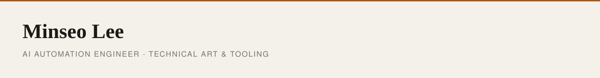

<picture>
  <source media="(prefers-color-scheme: dark)" srcset="./header-dark.svg">
  
</picture>

I don't paste model output into a repo. I turn it into a pipeline that can be measured, rerun, and verified at runtime — then I ship the consumer apps those pipelines feed.

[minseo.log](https://minseo-log.vercel.app) · [oracletarot.kr](https://oracletarot.kr) · [mindsurf0176@gmail.com](mailto:mindsurf0176@gmail.com)

---

**Tools** — local AI work that continues on a phone  
**Pipelines** — generated assets normalized until an engine will take them  
**Products** — consumer apps where billing, cache, and offline actually hold

---

### Pipelines & tools

| Project | What it is |
| --- | --- |
| **[RelayCode](https://github.com/mindsurf0176/relaycode)** | Remote-control local Codex from a phone. Repos, shell, and credentials stay off hosted services. |
| **[PixelForge](https://github.com/mindsurf0176/pixelforge-mcp)** | AI illustration → in-game pixel sprites. Pixelize, unify palettes, sheets, animation. [UE5 bridge](https://github.com/mindsurf0176/pixelforge-ue5-bridge) |
| **[Vesper](https://github.com/mindsurf0176/vesper)** | State-based sprites, deterministic assembly, Godot runtime QA. |
| **[AssetForge](https://github.com/mindsurf0176/assetforge)** | Deterministic 2D asset normalization, validation, and engine export. |
| **[CutAI](https://github.com/mindsurf0176/cutai)** | Local AI video editor driven by natural-language cuts. |
| **[Fissh](https://github.com/mindsurf0176/fissh)** | Claude Code from a phone. QR pairing, Tailscale auth. |

### Shipped

| Project | What it is |
| --- | --- |
| **[Oracle Tarot](https://oracletarot.kr)** | Paid LLM service. Deterministic engine, multi-provider fallback, billing recovery. |
| **[Haebari](https://github.com/mindsurf0176/haebari)** | Astrology app. Live on Toss, App Store under review. Four-layer cache, auth, sync. |
| **[Kotoba](https://github.com/mindsurf0176/kotoba)** | Offline Japanese learning. ONNX neural TTS + FSRS v5, in Swift. |
| **[Moodroll](https://github.com/mindsurf0176/moodroll)** | Film-camera iOS app. 48 on-device color-science filters. |

Build notes live on [minseo.log](https://minseo-log.vercel.app) — less product recap, more why a structure was chosen and how it was checked.

---

problem → measurable baseline → deterministic pipeline → runtime QA → production feedback
